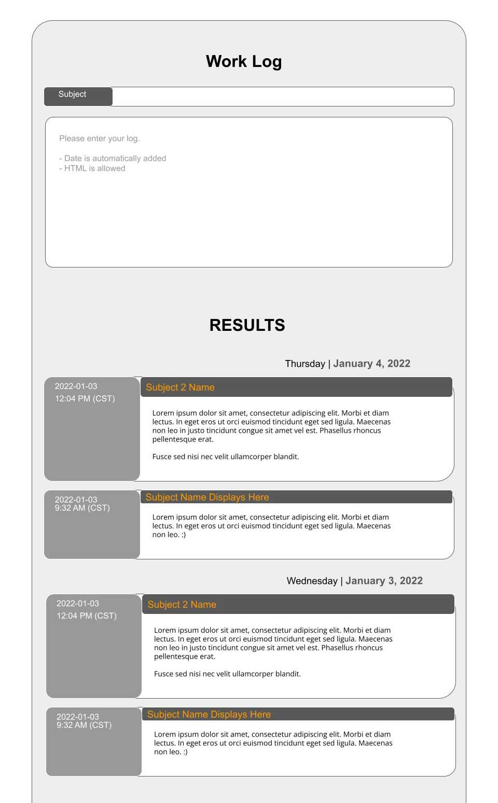

| Program Name     | **App: Work Logger** |
| ---------------- | ------------------------------------------------ |
| Public File Name | **README.md**                                    |
| Date Created     | 05/03/22                                         |
| Date Modified    | --                                               |
| Version          | 1.00                                             |
| Programmer       | Eric Hepperle                                    |

### TECHNOLOGIES:

 

## Purpose:
**<u>App:</u>** Lets user type notes or log entries which are then stored and retrieved using local storage. Includes datea and time info. Plain vanilla JavaScript.

### Demonstrates

- TBA

### Description

This is a JavaScript app I conceived and built from scratch using JavaScript ES6, Bootstrap, CSS Grid, and Flexbox.
  
### Project Screenshots:

#### Mockup (Google Slides)

Here is the mockup I made in Google Slides.

<aside class="warning in-progress">
  

    Warning
  

  

    This README.md file is incomplete and may be missing key information.
  

</aside>

## Usage:
1. N/A
   
## Sample results: 

- N/A

## Requires:
* A web browser

## TAGS:
`Modern JavaScript` `JavaScript` `ES6` `App`

## VOCAB:
- N/A

## Resources:
- N/A
